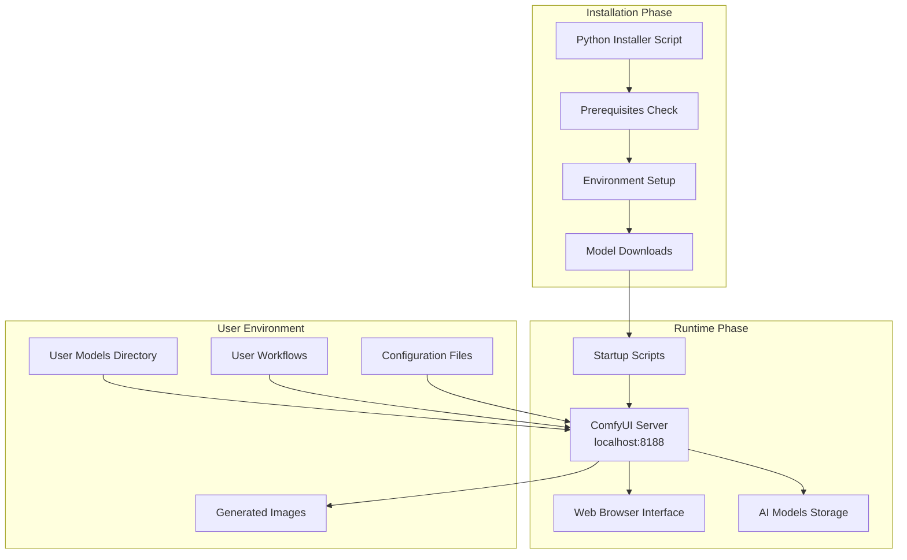

# 🔧 Technical Documentation - Flux ComfyUI Installer

> **Deep dive into the architecture, technologies, and implementation details of the automated Flux ComfyUI installation system.**

---

## 📋 Table of Contents

- [🏗️ Architecture Overview](#️-architecture-overview)
- [🐍 Python Installation Framework](#-python-installation-framework)
- [🧠 ComfyUI Integration](#-comfyui-integration)
- [🤖 AI Model Pipeline](#-ai-model-pipeline)
- [📁 File System Architecture](#-file-system-architecture)
- [🔄 Workflow Engine](#-workflow-engine)
- [⚙️ Configuration Management](#️-configuration-management)
- [🔐 Security Considerations](#-security-considerations)
- [🚀 Performance Optimizations](#-performance-optimizations)
- [🐛 Error Handling & Logging](#-error-handling--logging)
- [🔧 Installation System](#-installation-system)
- [📊 Monitoring & Diagnostics](#-monitoring--diagnostics)

---

## 🏗️ Architecture Overview

### **High-Level System Architecture**



### **Technology Stack Summary**

| **Component** | **Technology** | **Purpose** | **License** |
|:----------|:--------------|:-----------|:-----------|
| **Installer** | Python 3.8+ | Automated setup system | MIT |
| **AI Backend** | ComfyUI | Image generation engine | GPL-3.0 |
| **Model Runtime** | PyTorch + CUDA | Neural network execution | BSD-3-Clause |
| **AI Models** | FLUX.1-Schnell/Dev | Text-to-image generation | Apache-2.0 |
| **Environment** | Python venv | Isolated dependencies | Python License |
| **Interface** | ComfyUI Web UI | Professional node-based interface | GPL-3.0 |
| **Cross-Platform** | Python + shell scripts | Universal compatibility | Various |

---

## 🐍 Python Installation Framework

### **Installer Architecture**

The installer is built as a comprehensive Python class system that handles all aspects of setup:

```python
class FluxComfyUIInstaller:
    def __init__(self, install_dir="flux-comfyui"):
        self.install_dir = Path(install_dir).resolve()
        self.temp_dir = Path(tempfile.mkdtemp(prefix="flux_install_"))
        
        # Platform detection
        self.is_wsl = self.detect_wsl()
        self.platform = platform.system()
        
        # Configuration
        self.comfyui_repo = "https://github.com/comfyanonymous/ComfyUI.git"
        self.flux_model_urls = {
            "flux-schnell": "https://huggingface.co/black-forest-labs/FLUX.1-schnell/resolve/main/flux1-schnell.safetensors",
            "flux-dev": "https://huggingface.co/black-forest-labs/FLUX.1-dev/resolve/main/flux1-dev.safetensors"
        }
        
    def install(self):
        """Main installation orchestration"""
        self.check_prerequisites()
        self.setup_directory_structure()
        comfyui_dir = self.clone_comfyui()
        python_cmd, pip_cmd = self.setup_python_environment(comfyui_dir)
        self.download_flux_models(comfyui_dir)
        self.create_flux_workflows(comfyui_dir)
        self.setup_model_linking(comfyui_dir)
        self.create_startup_scripts(comfyui_dir, python_cmd)
        self.create_user_guide()
```

### **Cross-Platform Compatibility**

#### **Platform Detection and Adaptation:**
```python
def detect_platform_specifics(self):
    """Detect platform-specific requirements and paths"""
    
    if platform.system() == "Windows":
        return {
            'python_executable': 'python.exe',
            'venv_scripts': 'Scripts',
            'startup_extension': '.bat',
            'path_separator': '\\',
            'line_ending': '\r\n'
        }
    elif platform.system() == "Darwin":  # macOS
        return {
            'python_executable': 'python3',
            'venv_scripts': 'bin',
            'startup_extension': '.sh',
            'path_separator': '/',
            'line_ending': '\n'
        }
    else:  # Linux and others
        return {
            'python_executable': 'python3',
            'venv_scripts': 'bin', 
            'startup_extension': '.sh',
            'path_separator': '/',
            'line_ending': '\n'
        }

def create_platform_startup_script(self, comfyui_dir, python_cmd):
    """Create appropriate startup script for the platform"""
    platform_info = self.detect_platform_specifics()
    
    if platform.system() == "Windows":
        self.create_windows_startup_script(comfyui_dir, python_cmd)
    else:
        self.create_unix_startup_script(comfyui_dir, python_cmd)
```

#### **WSL (Windows Subsystem for Linux) Support:**
```python
def detect_wsl(self):
    """Detect Windows Subsystem for Linux"""
    try:
        with open('/proc/version', 'r') as f:
            content = f.read().lower()
            return 'microsoft' in content or 'wsl' in content
    except:
        return False

def handle_wsl_specifics(self):
    """Handle WSL-specific path and linking issues"""
    if self.is_wsl:
        self.log("WSL detected - using copy-based model linking for Windows compatibility")
        # Use file copying instead of symbolic links for better Windows compatibility
        return 'copy'
    else:
        return 'symlink'
```

---

## 🧠 ComfyUI Integration

### **ComfyUI Server Management**

#### **Installation and Setup:**
```python
def clone_comfyui(self):
    """Clone and setup ComfyUI from official repository"""
    self.log("Cloning ComfyUI from official repository...")
    
    comfyui_source_dir = self.install_dir / "ComfyUI"
    
    # Clone with specific optimizations
    clone_cmd = [
        "git", "clone", 
        "--depth", "1",  # Shallow clone for faster download
        "--single-branch",
        self.comfyui_repo, 
        str(comfyui_source_dir)
    ]
    
    self.run_command(clone_cmd, shell=False)
    
    # Verify critical files exist
    critical_files = ["main.py", "comfy", "web"]
    for file in critical_files:
        if not (comfyui_source_dir / file).exists():
            raise Exception(f"ComfyUI installation incomplete: {file} missing")
    
    return comfyui_source_dir

def setup_python_environment(self, comfyui_dir):
    """Create isolated Python environment with all dependencies"""
    self.log("Setting up Python virtual environment...")
    
    venv_dir = comfyui_dir / "venv"
    
    # Create virtual environment
    venv_cmd = [sys.executable, "-m", "venv", str(venv_dir)]
    self.run_command(venv_cmd, shell=False)
    
    # Get platform-specific paths
    platform_info = self.detect_platform_specifics()
    scripts_dir = venv_dir / platform_info['venv_scripts']
    python_path = scripts_dir / platform_info['python_executable']
    pip_path = scripts_dir / "pip"
    
    # Upgrade pip first
    self.run_command([str(python_path), "-m", "pip", "install", "--upgrade", "pip"])
    
    # Install PyTorch with CUDA support (with fallback)
    try:
        pytorch_cmd = [
            str(pip_path), "install", 
            "torch", "torchvision", "torchaudio",
            "--index-url", "https://download.pytorch.org/whl/cu118"
        ]
        self.run_command(pytorch_cmd, shell=False)
        self.log("SUCCESS PyTorch with CUDA support installed")
    except Exception as e:
        self.log(f"CUDA PyTorch failed, installing CPU version: {e}")
        cpu_pytorch_cmd = [str(pip_path), "install", "torch", "torchvision", "torchaudio"]
        self.run_command(cpu_pytorch_cmd, shell=False)
        self.log("WARNING CPU-only PyTorch installed")
    
    return str(python_path), str(pip_path)
```

### **Dependency Management**

#### **Requirements Installation:**
```python
def install_comfyui_dependencies(self, pip_cmd):
    """Install all required dependencies for ComfyUI and Flux models"""
    
    # Core ComfyUI requirements
    core_requirements = [
        "pillow>=9.0.0",
        "numpy>=1.24.0", 
        "opencv-python>=4.7.0",
        "transformers>=4.25.0",
        "accelerate>=0.20.0",
        "safetensors>=0.3.0",
        "tqdm>=4.64.0"
    ]
    
    # Flux-specific requirements
    flux_requirements = [
        "sentencepiece>=0.1.97",  # Text tokenization
        "protobuf>=3.20.0",       # Model serialization
        "compel>=2.0.0",          # Prompt weighting
        "diffusers>=0.21.0"       # Diffusion models support
    ]
    
    # Optional performance packages
    performance_requirements = [
        "xformers",               # Memory efficient attention (if available)
        "bitsandbytes",           # 8-bit optimization (if available)
        "triton"                  # GPU kernels (if available)
    ]
    
    # Install core requirements (required)
    for req in core_requirements + flux_requirements:
        try:
            self.run_command([pip_cmd, "install", req])
            self.log(f"SUCCESS Installed {req}")
        except Exception as e:
            self.log(f"ERROR Failed to install {req}: {e}")
            raise Exception(f"Critical dependency failed: {req}")
    
    # Install performance packages (optional)
    for req in performance_requirements:
        try:
            self.run_command([pip_cmd, "install", req])
            self.log(f"SUCCESS Installed optional package {req}")
        except Exception as e:
            self.log(f"WARNING Optional package {req} failed: {e}")

def verify_installation(self, python_cmd):
    """Verify that all critical packages are working"""
    verification_script = '''
import sys
try:
    import torch
    print(f"PyTorch: {torch.__version__}")
    print(f"CUDA available: {torch.cuda.is_available()}")
    if torch.cuda.is_available():
        print(f"CUDA devices: {torch.cuda.device_count()}")
    
    import transformers
    print(f"Transformers: {transformers.__version__}")
    
    import safetensors
    print(f"SafeTensors: {safetensors.__version__}")
    
    print("SUCCESS All critical packages verified")
    sys.exit(0)
    
except ImportError as e:
    print(f"ERROR Import failed: {e}")
    sys.exit(1)
except Exception as e:
    print(f"ERROR Verification failed: {e}")
    sys.exit(1)
'''
    
    try:
        result = self.run_command([python_cmd, "-c", verification_script])
        self.log("SUCCESS Python environment verification passed")
        return True
    except Exception as e:
        self.log(f"ERROR Python environment verification failed: {e}")
        return False
```

---

## 🤖 AI Model Pipeline

### **Model Architecture and Loading**

#### **Flux Model Pipeline:**
```
Text Prompt Input
        ↓
    CLIP Text Encoder
   (Text → Embeddings)
        ↓
    Flux Transformer
   (Latent Diffusion)
        ↓
    VAE Decoder
   (Latent → Image)
        ↓
   Generated Image
```

#### **Model Download System:**
```python
def download_flux_models(self, comfyui_dir):
    """Download and organize Flux models with progress tracking"""
    self.log("Downloading Flux models...")
    
    # Create model directory structure
    models_dir = comfyui_dir / "models"
    checkpoints_dir = models_dir / "checkpoints"
    vae_dir = models_dir / "vae"
    upscale_dir = models_dir / "upscale_models"
    
    for dir_path in [checkpoints_dir, vae_dir, upscale_dir]:
        dir_path.mkdir(parents=True, exist_ok=True)
    
    # Download Flux Schnell (primary model)
    schnell_path = checkpoints_dir / "flux1-schnell.safetensors"
    if not schnell_path.exists():
        self.log("Downloading Flux Schnell model...")
        success = self.download_with_progress(
            self.flux_model_urls["flux-schnell"], 
            schnell_path
        )
        if success:
            self.log("SUCCESS Flux Schnell downloaded")
            # Copy to user directory for easy access
            user_models_dir = self.install_dir / "user_models"
            user_models_dir.mkdir(exist_ok=True)
            shutil.copy2(schnell_path, user_models_dir / "flux1-schnell.safetensors")
    
    # Download Flux Dev (optional, higher quality)
    dev_path = checkpoints_dir / "flux1-dev.safetensors"
    if not dev_path.exists():
        self.log("Downloading Flux Dev model (optional)...")
        success = self.download_with_progress(
            self.flux_model_urls["flux-dev"], 
            dev_path
        )
        if success:
            self.log("SUCCESS Flux Dev downloaded")

def download_with_progress(self, url, path):
    """Download with progress indication and resumption support"""
    if not url:
        self.log(f"WARNING: No URL provided for {path.name}")
        return False
    
    try:
        # Check if partially downloaded file exists
        temp_path = Path(str(path) + ".partial")
        
        headers = {}
        initial_pos = 0
        if temp_path.exists():
            initial_pos = temp_path.stat().st_size
            headers['Range'] = f'bytes={initial_pos}-'
            self.log(f"Resuming download from byte {initial_pos}")
        
        # Create request with headers
        request = urllib.request.Request(url, headers=headers)
        
        with urllib.request.urlopen(request) as response:
            total_size = int(response.headers.get('content-length', 0))
            if 'content-range' in response.headers:
                total_size = int(response.headers['content-range'].split('/')[-1])
            
            downloaded = initial_pos
            
            # Progress tracking
            def show_progress(downloaded, total):
                if total > 0:
                    percent = (downloaded * 100) // total
                    mb_downloaded = downloaded / (1024 * 1024)
                    mb_total = total / (1024 * 1024)
                    self.log(f"  Progress: {percent}% ({mb_downloaded:.1f}/{mb_total:.1f} MB)")
            
            # Download in chunks
            chunk_size = 8192
            mode = 'ab' if initial_pos > 0 else 'wb'
            
            with open(temp_path, mode) as f:
                last_update = 0
                while True:
                    chunk = response.read(chunk_size)
                    if not chunk:
                        break
                    
                    f.write(chunk)
                    downloaded += len(chunk)
                    
                    # Update progress every 1MB
                    if downloaded - last_update > 1024 * 1024:
                        show_progress(downloaded, total_size)
                        last_update = downloaded
            
            # Final progress update
            show_progress(downloaded, total_size or downloaded)
            
            # Move completed file to final location
            shutil.move(temp_path, path)
            self.log(f"SUCCESS Downloaded {path.name}")
            return True
            
    except Exception as e:
        self.log(f"FAILED to download {path.name}: {e}")
        # Clean up partial file on error
        if temp_path.exists():
            temp_path.unlink()
        return False
```

### **Model Organization and Linking**

#### **User-Friendly Model Management:**
```python
def setup_model_linking(self, comfyui_dir):
    """Create user-accessible model directories linked to ComfyUI"""
    self.log("Setting up model directory linking...")
    
    user_models_dir = self.install_dir / "user_models"
    user_loras_dir = self.install_dir / "user_loras"
    
    comfyui_models_dir = comfyui_dir / "models"
    
    # Ensure directories exist
    user_models_dir.mkdir(exist_ok=True)
    user_loras_dir.mkdir(exist_ok=True)
    (comfyui_models_dir / "checkpoints").mkdir(parents=True, exist_ok=True)
    (comfyui_models_dir / "loras").mkdir(parents=True, exist_ok=True)
    
    # Link directories based on platform capabilities
    linking_strategy = self.determine_linking_strategy()
    
    try:
        if linking_strategy == 'symlink':
            self.create_symlinks(user_models_dir, user_loras_dir, comfyui_models_dir)
        elif linking_strategy == 'junction':
            self.create_junctions(user_models_dir, user_loras_dir, comfyui_models_dir)
        else:  # copy
            self.setup_copy_sync(user_models_dir, user_loras_dir, comfyui_models_dir)
            
    except Exception as e:
        self.log(f"WARNING: Advanced linking failed, using copy fallback: {e}")
        self.setup_copy_sync(user_models_dir, user_loras_dir, comfyui_models_dir)

def determine_linking_strategy(self):
    """Determine best file linking strategy for the platform"""
    if self.is_wsl:
        return 'copy'  # WSL compatibility
    elif platform.system() == "Windows":
        return 'junction'  # Windows junction points
    else:
        return 'symlink'  # Unix symbolic links

def create_symlinks(self, user_models_dir, user_loras_dir, comfyui_models_dir):
    """Create symbolic links on Unix systems"""
    user_checkpoints_link = comfyui_models_dir / "user_checkpoints"
    user_loras_link = comfyui_models_dir / "user_loras"
    
    if user_checkpoints_link.exists():
        user_checkpoints_link.unlink()
    if user_loras_link.exists():
        user_loras_link.unlink()
    
    user_checkpoints_link.symlink_to(user_models_dir.resolve())
    user_loras_link.symlink_to(user_loras_dir.resolve())
    
    self.log("SUCCESS Created symbolic links for user directories")
```

---

## 📁 File System Architecture

### **Directory Structure Design**

```
flux-comfyui/                    # Main installation directory
├── ComfyUI/                     # ComfyUI installation
│   ├── main.py                  # ComfyUI server entry point
│   ├── venv/                    # Python virtual environment
│   │   ├── Scripts/ (Windows)   # Python executables
│   │   ├── bin/ (Unix)          # Python executables  
│   │   └── Lib/site-packages/   # Python packages
│   ├── models/                  # AI models directory (ComfyUI internal)
│   │   ├── checkpoints/         # Main diffusion models
│   │   ├── loras/               # LoRA adaptation files
│   │   ├── vae/                 # VAE models
│   │   ├── upscale_models/      # Upscaling models
│   │   ├── user_checkpoints/    # → Link to user_models/
│   │   └── user_loras/          # → Link to user_loras/
│   ├── user_models/             # 🎯 USER-ACCESSIBLE: Custom models
│   │   ├── flux1-schnell.safetensors  # Pre-installed
│   │   ├── flux1-dev.safetensors      # Optional
│   │   └── README.md            # User instructions
│   ├── user_loras/              # 🎯 USER-ACCESSIBLE: LoRA files
│   │   └── README.md            # LoRA instructions
│   ├── user_workflows/          # 🎯 USER-ACCESSIBLE: Custom workflows
│   │   ├── flux_schnell_basic.json # Basic generation
│   │   ├── flux_portrait.json   # Portrait optimized
│   │   ├── flux_landscape.json  # Landscape optimized
│   │   └── README.md            # Workflow guide
│   ├── user_outputs/            # 🎯 USER-ACCESSIBLE: Generated images
│   │   └── README.md            # Output information
│   ├── custom_nodes/            # ComfyUI extensions
│   │   └── ComfyUI-Manager/     # Node manager (auto-installed)
│   ├── workflows/               # Internal workflows
│   ├── input/                   # Input images directory
│   └── output/                  # Default output directory
├── user_models/                 # → Convenience symlink to ComfyUI/user_models/
├── user_workflows/              # → Convenience symlink to ComfyUI/user_workflows/
├── user_loras/                  # → Convenience symlink to ComfyUI/user_loras/
├── user_outputs/                # → Convenience symlink to ComfyUI/user_outputs/
├── start_comfyui.bat/.sh        # Platform startup script
├── start_comfyui_highperf.bat/.sh  # High performance mode
├── USER_GUIDE.md                # Comprehensive user guide
└── installation.log             # Installation log file
```

### **Configuration Management System**

#### **Hierarchical Configuration:**
```python
class ConfigurationManager:
    def __init__(self, install_dir):
        self.install_dir = Path(install_dir)
        self.config_file = self.install_dir / "flux_config.json"
        self.user_config = {}
        self.default_config = self.get_default_config()
        
    def get_default_config(self):
        """Define comprehensive default configuration"""
        return {
            "installation": {
                "version": "1.0.0",
                "install_date": datetime.now().isoformat(),
                "platform": platform.system(),
                "python_version": sys.version,
                "comfyui_version": "latest"
            },
            "paths": {
                "comfyui_dir": "./ComfyUI",
                "models_dir": "./user_models",
                "loras_dir": "./user_loras",
                "workflows_dir": "./user_workflows",
                "outputs_dir": "./user_outputs"
            },
            "server": {
                "host": "127.0.0.1",
                "port": 8188,
                "auto_start": True,
                "gpu_acceleration": True
            },
            "models": {
                "default_checkpoint": "flux1-schnell.safetensors",
                "auto_load": True,
                "download_dev_model": False,
                "enable_loras": True
            },
            "generation": {
                "default_width": 1024,
                "default_height": 1024,
                "default_steps": 4,
                "default_cfg": 1.0,
                "default_sampler": "euler",
                "auto_save": True
            },
            "performance": {
                "cpu_only": False,
                "low_vram": False,
                "enable_xformers": True,
                "enable_attention_slicing": False
            }
        }
    
    def save_config(self):
        """Save current configuration to file"""
        merged_config = self.merge_configs(self.default_config, self.user_config)
        
        with open(self.config_file, 'w') as f:
            json.dump(merged_config, f, indent=2, default=str)
    
    def load_config(self):
        """Load configuration from file with validation"""
        if self.config_file.exists():
            try:
                with open(self.config_file, 'r') as f:
                    self.user_config = json.load(f)
                return self.merge_configs(self.default_config, self.user_config)
            except (json.JSONDecodeError, FileNotFoundError) as e:
                self.log(f"Config load failed, using defaults: {e}")
                return self.default_config
        else:
            return self.default_config
```

---

## 🔄 Workflow Engine

### **ComfyUI Workflow System**

#### **Workflow Structure and Creation:**
```python
def create_flux_workflows(self, comfyui_dir):
    """Create optimized workflows for different use cases"""
    self.log("Creating Flux workflows...")
    
    workflows_dir = comfyui_dir / "workflows"
    user_workflows_dir = self.install_dir / "user_workflows"
    
    workflows_dir.mkdir(exist_ok=True)
    user_workflows_dir.mkdir(exist_ok=True)
    
    # Define workflow templates
    workflows = {
        "flux_schnell_basic.json": self.create_basic_workflow(),
        "flux_portrait.json": self.create_portrait_workflow(),
        "flux_landscape.json": self.create_landscape_workflow(),
        "flux_artistic.json": self.create_artistic_workflow()
    }
    
    # Save workflows to both locations
    for filename, workflow in workflows.items():
        # ComfyUI internal workflows
        workflow_path = workflows_dir / filename
        with open(workflow_path, "w") as f:
            json.dump(workflow, f, indent=2)
            
        # User-accessible workflows
        user_workflow_path = user_workflows_dir / filename
        with open(user_workflow_path, "w") as f:
            json.dump(workflow, f, indent=2)
    
    self.log(f"SUCCESS Created {len(workflows)} workflow files")

def create_basic_workflow(self):
    """Create basic Flux Schnell workflow for fast generation"""
    return {
        "1": {
            "inputs": {"ckpt_name": "flux1-schnell.safetensors"},
            "class_type": "CheckpointLoaderSimple",
            "_meta": {"title": "Load Flux Schnell Model"}
        },
        "2": {
            "inputs": {
                "text": "A beautiful portrait with natural lighting, photorealistic, high detail",
                "clip": ["1", 1]
            },
            "class_type": "CLIPTextEncode",
            "_meta": {"title": "Positive Prompt"}
        },
        "3": {
            "inputs": {
                "text": "blurry, low quality, distorted, cartoon, anime",
                "clip": ["1", 1]
            },
            "class_type": "CLIPTextEncode", 
            "_meta": {"title": "Negative Prompt"}
        },
        "4": {
            "inputs": {"width": 1024, "height": 1024, "batch_size": 1},
            "class_type": "EmptyLatentImage",
            "_meta": {"title": "Image Dimensions"}
        },
        "5": {
            "inputs": {
                "seed": 42,
                "steps": 4,
                "cfg": 1.0,
                "sampler_name": "euler",
                "scheduler": "simple", 
                "denoise": 1.0,
                "model": ["1", 0],
                "positive": ["2", 0],
                "negative": ["3", 0],
                "latent_image": ["4", 0]
            },
            "class_type": "KSampler",
            "_meta": {"title": "Generate Image"}
        },
        "6": {
            "inputs": {"samples": ["5", 0], "vae": ["1", 2]},
            "class_type": "VAEDecode",
            "_meta": {"title": "Decode Latent"}
        },
        "7": {
            "inputs": {"images": ["6", 0], "filename_prefix": "flux_basic"},
            "class_type": "SaveImage",
            "_meta": {"title": "Save Image"}
        }
    }

def create_portrait_workflow(self):
    """Create portrait-optimized workflow with ideal dimensions"""
    workflow = self.create_basic_workflow()
    
    # Modify for portrait optimization
    workflow["2"]["inputs"]["text"] = "Professional headshot portrait, beautiful eyes, natural skin texture, soft lighting, shallow depth of field, photorealistic, high detail, 8k"
    workflow["4"]["inputs"]["width"] = 832
    workflow["4"]["inputs"]["height"] = 1216
    workflow["5"]["inputs"]["steps"] = 4
    workflow["7"]["inputs"]["filename_prefix"] = "flux_portrait"
    
    # Add metadata
    workflow["_meta"] = {
        "title": "Flux Portrait Workflow",
        "description": "Optimized for portrait photography with 2:3 aspect ratio",
        "recommended_settings": {
            "steps": 4,
            "cfg": 1.0,
            "dimensions": "832x1216"
        }
    }
    
    return workflow

def create_landscape_workflow(self):
    """Create landscape-optimized workflow"""
    workflow = self.create_basic_workflow()
    
    # Modify for landscape optimization  
    workflow["2"]["inputs"]["text"] = "Beautiful landscape photography, dramatic lighting, golden hour, detailed foreground and background, professional composition, 8k resolution"
    workflow["4"]["inputs"]["width"] = 1344
    workflow["4"]["inputs"]["height"] = 768
    workflow["7"]["inputs"]["filename_prefix"] = "flux_landscape"
    
    workflow["_meta"] = {
        "title": "Flux Landscape Workflow", 
        "description": "Optimized for landscape photography with 16:9 aspect ratio",
        "recommended_settings": {
            "steps": 4,
            "cfg": 1.0,
            "dimensions": "1344x768"
        }
    }
    
    return workflow
```

### **Workflow Validation and Documentation**

#### **Workflow Schema Validation:**
```python
class WorkflowValidator:
    def __init__(self):
        self.required_node_types = [
            "CheckpointLoaderSimple",
            "CLIPTextEncode", 
            "KSampler",
            "VAEDecode",
            "SaveImage"
        ]
        
    def validate_workflow(self, workflow):
        """Validate workflow structure and completeness"""
        errors = []
        warnings = []
        
        # Check if workflow is a dictionary
        if not isinstance(workflow, dict):
            errors.append("Workflow must be a JSON object")
            return {"valid": False, "errors": errors, "warnings": warnings}
        
        # Check for required node types
        found_types = set()
        for node_id, node_data in workflow.items():
            if node_id.startswith("_"):  # Skip metadata
                continue
                
            if "class_type" in node_data:
                found_types.add(node_data["class_type"])
            else:
                errors.append(f"Node {node_id} missing class_type")
        
        # Verify required nodes are present
        missing_types = set(self.required_node_types) - found_types
        if missing_types:
            errors.append(f"Missing required node types: {', '.join(missing_types)}")
        
        # Validate node connections
        self.validate_connections(workflow, errors, warnings)
        
        # Check for reasonable parameters
        self.validate_parameters(workflow, warnings)
        
        return {
            "valid": len(errors) == 0,
            "errors": errors,
            "warnings": warnings,
            "node_count": len([k for k in workflow.keys() if not k.startswith("_")]),
            "found_types": list(found_types)
        }
    
    def validate_connections(self, workflow, errors, warnings):
        """Validate node input/output connections"""
        for node_id, node_data in workflow.items():
            if node_id.startswith("_"):
                continue
                
            inputs = node_data.get("inputs", {})
            for input_name, input_value in inputs.items():
                if isinstance(input_value, list) and len(input_value) == 2:
                    source_node, output_index = input_value
                    if source_node not in workflow:
                        errors.append(f"Node {node_id} references non-existent node {source_node}")
    
    def validate_parameters(self, workflow, warnings):
        """Check for reasonable parameter values"""
        for node_id, node_data in workflow.items():
            if node_data.get("class_type") == "KSampler":
                inputs = node_data.get("inputs", {})
                
                steps = inputs.get("steps", 0)
                if steps > 50:
                    warnings.append(f"Node {node_id}: High step count ({steps}) may be slow")
                elif steps < 1:
                    warnings.append(f"Node {node_id}: Step count too low ({steps})")
                
                cfg = inputs.get("cfg", 0)
                if cfg > 15:
                    warnings.append(f"Node {node_id}: Very high CFG ({cfg}) may cause artifacts")
```

---

## ⚙️ Configuration Management

### **Installation Configuration**

#### **Installation Options and Customization:**
```python
def parse_installation_options(self):
    """Parse command-line arguments and configuration options"""
    parser = argparse.ArgumentParser(description="Install ComfyUI with Flux models")
    
    # Basic options
    parser.add_argument("--install-dir", default="flux-comfyui", 
                       help="Installation directory (default: flux-comfyui)")
    parser.add_argument("--skip-models", action="store_true",
                       help="Skip model downloads (faster for testing)")
    
    # Advanced options
    parser.add_argument("--cuda-version", default="cu118",
                       choices=["cu118", "cu121", "cpu"],
                       help="CUDA version for PyTorch installation")
    parser.add_argument("--python-version", default="3.10",
                       help="Python version for virtual environment")
    parser.add_argument("--download-dev", action="store_true",
                       help="Download Flux Dev model (larger, higher quality)")
    parser.add_argument("--performance-mode", choices=["balanced", "speed", "quality"],
                       default="balanced", help="Performance optimization preset")
    
    # Platform options
    parser.add_argument("--force-cpu", action="store_true",
                       help="Force CPU-only installation (no CUDA)")
    parser.add_argument("--low-memory", action="store_true", 
                       help="Optimize for systems with limited RAM")
    
    return parser.parse_args()

def apply_performance_preset(self, mode):
    """Apply performance optimization presets"""
    presets = {
        "speed": {
            "default_steps": 4,
            "default_cfg": 1.0,
            "enable_xformers": True,
            "enable_flash_attention": True,
            "model_offload": False
        },
        "balanced": {
            "default_steps": 8,
            "default_cfg": 2.0,
            "enable_xformers": True,
            "enable_flash_attention": False,
            "model_offload": False
        },
        "quality": {
            "default_steps": 20,
            "default_cfg": 3.5,
            "enable_xformers": False,
            "enable_flash_attention": False,
            "model_offload": True
        }
    }
    
    return presets.get(mode, presets["balanced"])
```

### **Runtime Configuration Management**

#### **Configuration File Structure:**
```json
{
  "installation": {
    "version": "1.0.0",
    "install_date": "2024-01-15T10:30:00",
    "platform": "Windows",
    "python_version": "3.10.11",
    "comfyui_commit": "abc123def456"
  },
  "paths": {
    "comfyui_dir": "./ComfyUI",
    "models_dir": "./user_models", 
    "loras_dir": "./user_loras",
    "workflows_dir": "./user_workflows",
    "outputs_dir": "./user_outputs"
  },
  "server": {
    "host": "127.0.0.1",
    "port": 8188,
    "auto_open_browser": true,
    "enable_api": true
  },
  "models": {
    "available_checkpoints": [
      "flux1-schnell.safetensors",
      "flux1-dev.safetensors"
    ],
    "default_checkpoint": "flux1-schnell.safetensors",
    "auto_scan_models": true,
    "scan_interval_seconds": 30
  },
  "generation_defaults": {
    "width": 1024,
    "height": 1024,
    "steps": 4,
    "cfg_scale": 1.0,
    "sampler": "euler",
    "scheduler": "simple"
  },
  "performance": {
    "gpu_enabled": true,
    "low_vram_mode": false,
    "cpu_fallback": true,
    "memory_fraction": 0.9,
    "attention_optimization": "xformers"
  },
  "ui_preferences": {
    "theme": "dark",
    "auto_save_workflows": true,
    "show_advanced_options": false,
    "progress_updates": true
  }
}
```

---

## 🔐 Security Considerations

### **Installation Security**

#### **Safe Download and Verification:**
```python
def verify_download_integrity(self, file_path, expected_hash=None):
    """Verify downloaded file integrity using checksums"""
    if not expected_hash:
        self.log("WARNING: No hash provided for verification")
        return True
    
    try:
        import hashlib
        
        sha256_hash = hashlib.sha256()
        with open(file_path, "rb") as f:
            # Read in chunks to handle large files
            for chunk in iter(lambda: f.read(4096), b""):
                sha256_hash.update(chunk)
        
        calculated_hash = sha256_hash.hexdigest()
        
        if calculated_hash == expected_hash:
            self.log("SUCCESS File integrity verified")
            return True
        else:
            self.log(f"ERROR Hash mismatch: expected {expected_hash}, got {calculated_hash}")
            return False
            
    except Exception as e:
        self.log(f"ERROR Verification failed: {e}")
        return False

def validate_download_url(self, url):
    """Validate download URLs to prevent malicious downloads"""
    from urllib.parse import urlparse
    
    parsed = urlparse(url)
    
    # Whitelist of trusted domains
    trusted_domains = [
        "huggingface.co",
        "github.com", 
        "pytorch.org",
        "pypi.org"
    ]
    
    if parsed.netloc not in trusted_domains:
        raise SecurityError(f"Untrusted download domain: {parsed.netloc}")
    
    # Ensure HTTPS
    if parsed.scheme != "https":
        raise SecurityError(f"Insecure download protocol: {parsed.scheme}")
    
    return True
```

#### **Path Traversal Prevention:**
```python
def safe_path_join(self, base_path, *paths):
    """Safely join paths to prevent directory traversal attacks"""
    base_resolved = Path(base_path).resolve()
    
    for path_component in paths:
        # Remove any path traversal attempts
        clean_component = str(path_component).replace('..', '').replace('/', '').replace('\\', '')
        
        if not clean_component:
            continue
            
        base_resolved = base_resolved / clean_component
    
    # Ensure final path is within base directory
    try:
        base_resolved.resolve().relative_to(Path(base_path).resolve())
        return base_resolved
    except ValueError:
        raise SecurityError(f"Path traversal attempt detected: {base_resolved}")

def sanitize_filename(self, filename):
    """Sanitize filenames to prevent security issues"""
    import re
    
    # Remove path components
    filename = os.path.basename(filename)
    
    # Remove dangerous characters
    filename = re.sub(r'[<>:"/\\|?*]', '', filename)
    
    # Remove control characters
    filename = ''.join(char for char in filename if ord(char) >= 32)
    
    # Limit length
    if len(filename) > 255:
        name, ext = os.path.splitext(filename)
        filename = name[:255-len(ext)] + ext
    
    # Ensure not empty
    if not filename:
        filename = "unnamed_file"
    
    return filename
```

### **Runtime Security**

#### **Input Validation:**
```python
class InputValidator:
    @staticmethod
    def validate_prompt(prompt):
        """Validate user prompts for safety"""
        if not isinstance(prompt, str):
            raise ValueError("Prompt must be a string")
        
        # Length limits
        if len(prompt) > 5000:
            raise ValueError("Prompt too long (max 5000 characters)")
        
        if len(prompt.strip()) == 0:
            raise ValueError("Prompt cannot be empty")
        
        # Content filtering (basic)
        banned_patterns = [
            r'<script[^>]*>.*?</script>',  # JavaScript injection
            r'javascript:',                # JavaScript URLs
            r'data:.*base64',             # Data URLs
        ]
        
        import re
        for pattern in banned_patterns:
            if re.search(pattern, prompt, re.IGNORECASE | re.DOTALL):
                raise ValueError("Prompt contains potentially unsafe content")
        
        return prompt.strip()
    
    @staticmethod
    def validate_generation_params(params):
        """Validate generation parameters"""
        validated = {}
        
        # Width and height
        for dim in ['width', 'height']:
            if dim in params:
                value = int(params[dim])
                if not 64 <= value <= 4096:
                    raise ValueError(f"{dim} must be between 64 and 4096")
                if value % 8 != 0:
                    raise ValueError(f"{dim} must be divisible by 8")
                validated[dim] = value
        
        # Steps
        if 'steps' in params:
            steps = int(params['steps'])
            if not 1 <= steps <= 100:
                raise ValueError("Steps must be between 1 and 100")
            validated['steps'] = steps
        
        # CFG scale
        if 'cfg' in params:
            cfg = float(params['cfg'])
            if not 0.0 <= cfg <= 30.0:
                raise ValueError("CFG scale must be between 0.0 and 30.0")
            validated['cfg'] = cfg
        
        return validated
```

---

## 🚀 Performance Optimizations

### **Memory Management**

#### **Efficient Model Loading:**
```python
class MemoryOptimizedModelManager:
    def __init__(self):
        self.loaded_models = {}
        self.memory_threshold = 0.8  # 80% of available VRAM
        
    def get_available_memory(self):
        """Get available GPU memory"""
        try:
            import torch
            if torch.cuda.is_available():
                torch.cuda.synchronize()
                free_memory = torch.cuda.get_device_properties(0).total_memory - torch.cuda.memory_allocated()
                total_memory = torch.cuda.get_device_properties(0).total_memory
                return free_memory, total_memory
        except:
            pass
        
        # Fallback to system RAM
        import psutil
        memory = psutil.virtual_memory()
        return memory.available, memory.total
    
    def should_offload_models(self):
        """Determine if models should be offloaded to save memory"""
        free_memory, total_memory = self.get_available_memory()
        usage = (total_memory - free_memory) / total_memory
        return usage > self.memory_threshold
    
    def optimize_for_low_memory(self, model):
        """Apply memory optimizations to models"""
        try:
            import torch
            
            # Enable gradient checkpointing
            if hasattr(model, 'enable_gradient_checkpointing'):
                model.enable_gradient_checkpointing()
            
            # Use half precision
            if torch.cuda.is_available():
                model = model.half()
            
            # Enable attention slicing
            if hasattr(model, 'enable_attention_slicing'):
                model.enable_attention_slicing(1)
            
            # Enable CPU offloading for very low memory
            if self.should_offload_models():
                if hasattr(model, 'enable_sequential_cpu_offload'):
                    model.enable_sequential_cpu_offload()
            
            return model
            
        except Exception as e:
            self.log(f"Memory optimization failed: {e}")
            return model
```

### **Startup Optimization**

#### **Optimized Startup Scripts:**
```python
def create_optimized_startup_script(self, comfyui_dir, python_cmd):
    """Create startup script with performance optimizations"""
    
    platform_info = self.detect_platform_specifics()
    script_ext = platform_info['startup_extension']
    script_name = f"start_comfyui{script_ext}"
    script_path = self.install_dir / script_name
    
    if platform.system() == "Windows":
        script_content = f'''@echo off
title ComfyUI with Flux Models - Starting...
echo.
echo Starting ComfyUI with Flux models...
echo This may take 30-60 seconds on first launch.
echo.

REM Set environment variables for optimal performance
set PYTORCH_CUDA_ALLOC_CONF=max_split_size_mb:512
set CUDA_VISIBLE_DEVICES=0
set OMP_NUM_THREADS=4

REM Change to ComfyUI directory
cd /d "{comfyui_dir}"

REM Start ComfyUI with optimized settings
echo Loading models and starting server...
"{python_cmd}" main.py ^
    --port 8188 ^
    --listen 0.0.0.0 ^
    --output-directory "{self.install_dir / 'user_outputs'}" ^
    --auto-launch-browser ^
    --enable-cors-header

echo.
echo ComfyUI server stopped.
pause
'''
    else:  # Unix systems
        script_content = f'''#!/bin/bash
echo "Starting ComfyUI with Flux models..."
echo "This may take 30-60 seconds on first launch."
echo

# Set environment variables for optimal performance
export PYTORCH_CUDA_ALLOC_CONF=max_split_size_mb:512
export CUDA_VISIBLE_DEVICES=0
export OMP_NUM_THREADS=4

# Change to ComfyUI directory
cd "{comfyui_dir}"

# Start ComfyUI with optimized settings
echo "Loading models and starting server..."
"{python_cmd}" main.py \\
    --port 8188 \\
    --listen 0.0.0.0 \\
    --output-directory "{self.install_dir / 'user_outputs'}" \\
    --auto-launch-browser \\
    --enable-cors-header

echo
echo "ComfyUI server stopped."
read -p "Press Enter to continue..."
'''
    
    with open(script_path, 'w') as f:
        f.write(script_content)
    
    # Make executable on Unix
    if platform.system() != "Windows":
        import stat
        script_path.chmod(stat.S_IRWXU | stat.S_IRGRP | stat.S_IROTH)
    
    # Create high-performance variant
    self.create_high_performance_script(comfyui_dir, python_cmd)

def create_high_performance_script(self, comfyui_dir, python_cmd):
    """Create high-performance startup script for powerful systems"""
    
    platform_info = self.detect_platform_specifics()
    script_ext = platform_info['startup_extension']
    script_name = f"start_comfyui_highperf{script_ext}"
    script_path = self.install_dir / script_name
    
    if platform.system() == "Windows":
        script_content = f'''@echo off
title ComfyUI High Performance Mode
echo.
echo Starting ComfyUI in HIGH PERFORMANCE mode...
echo This mode uses more VRAM but generates faster.
echo Requirements: 8GB+ VRAM, 16GB+ RAM
echo.

REM High performance environment variables
set PYTORCH_CUDA_ALLOC_CONF=max_split_size_mb:1024
set CUDA_VISIBLE_DEVICES=0
set OMP_NUM_THREADS=8

cd /d "{comfyui_dir}"

echo Loading models in high performance mode...
"{python_cmd}" main.py ^
    --port 8188 ^
    --listen 0.0.0.0 ^
    --output-directory "{self.install_dir / 'user_outputs'}" ^
    --highvram ^
    --dont-upcast-attention ^
    --bf16-unet ^
    --auto-launch-browser

pause
'''
    else:
        script_content = f'''#!/bin/bash
echo "Starting ComfyUI in HIGH PERFORMANCE mode..."
echo "This mode uses more VRAM but generates faster."
echo "Requirements: 8GB+ VRAM, 16GB+ RAM"
echo

# High performance environment variables
export PYTORCH_CUDA_ALLOC_CONF=max_split_size_mb:1024
export CUDA_VISIBLE_DEVICES=0
export OMP_NUM_THREADS=8

cd "{comfyui_dir}"

echo "Loading models in high performance mode..."
"{python_cmd}" main.py \\
    --port 8188 \\
    --listen 0.0.0.0 \\
    --output-directory "{self.install_dir / 'user_outputs'}" \\
    --highvram \\
    --dont-upcast-attention \\
    --bf16-unet \\
    --auto-launch-browser

read -p "Press Enter to continue..."
'''
    
    with open(script_path, 'w') as f:
        f.write(script_content)
    
    if platform.system() != "Windows":
        import stat
        script_path.chmod(stat.S_IRWXU | stat.S_IRGRP | stat.S_IROTH)
```

---

## 🐛 Error Handling & Logging

### **Comprehensive Error Management**

#### **Installation Error Handling:**
```python
class InstallationError(Exception):
    """Custom exception for installation-related errors"""
    def __init__(self, message, error_code=None, details=None):
        super().__init__(message)
        self.error_code = error_code
        self.details = details or {}
        self.timestamp = datetime.now().isoformat()

class ErrorHandler:
    def __init__(self, install_dir):
        self.install_dir = install_dir
        self.log_file = install_dir / "installation.log"
        self.error_count = 0
        
    def handle_error(self, error, context="installation"):
        """Handle errors with appropriate logging and user guidance"""
        self.error_count += 1
        
        error_info = {
            "timestamp": datetime.now().isoformat(),
            "context": context,
            "error_type": type(error).__name__,
            "message": str(error),
            "details": getattr(error, 'details', {}),
            "platform": platform.system(),
            "python_version": sys.version
        }
        
        # Log error
        self.log_error(error_info)
        
        # Provide user guidance
        guidance = self.get_error_guidance(error)
        if guidance:
            print(f"\n💡 Suggested solution: {guidance}")
        
        # Offer recovery options
        recovery = self.get_recovery_options(error)
        if recovery:
            print(f"\n🔧 Recovery options:")
            for option in recovery:
                print(f"  - {option}")
    
    def log_error(self, error_info):
        """Log error to file and console"""
        log_entry = f"[{error_info['timestamp']}] ERROR: {error_info['message']}\n"
        log_entry += f"  Context: {error_info['context']}\n"
        log_entry += f"  Type: {error_info['error_type']}\n"
        log_entry += f"  Platform: {error_info['platform']}\n"
        
        # Write to log file
        try:
            with open(self.log_file, 'a', encoding='utf-8') as f:
                f.write(log_entry + "\n")
        except:
            pass  # Don't fail if logging fails
        
        # Print to console
        print(f"❌ ERROR: {error_info['message']}")
    
    def get_error_guidance(self, error):
        """Provide specific guidance based on error type"""
        error_guidance = {
            "command not found": "Install the missing command using your system's package manager",
            "permission denied": "Run the installer with administrator/sudo privileges",
            "network": "Check your internet connection and try again",
            "disk space": "Free up disk space (need at least 15GB)",
            "python": "Install Python 3.8+ from python.org",
            "git": "Install Git from git-scm.com",
            "cuda": "Install NVIDIA drivers and CUDA toolkit",
            "memory": "Close other applications to free up memory"
        }
        
        error_message = str(error).lower()
        for key, guidance in error_guidance.items():
            if key in error_message:
                return guidance
        
        return None
    
    def get_recovery_options(self, error):
        """Provide recovery options based on error type"""
        error_message = str(error).lower()
        
        if "network" in error_message or "download" in error_message:
            return [
                "Check your internet connection",
                "Try running the installer again (it can resume downloads)",
                "Use the --skip-models flag to install without downloading models"
            ]
        elif "permission" in error_message:
            return [
                "Run the installer as administrator (Windows) or with sudo (Linux/Mac)",
                "Check file permissions in the installation directory",
                "Try installing to a different directory"
            ]
        elif "space" in error_message or "disk" in error_message:
            return [
                "Free up at least 15GB of disk space",
                "Install to a different drive with more space",
                "Use --skip-models to reduce space requirements"
            ]
        
        return [
            "Check the installation.log file for detailed error information",
            "Try running the installer again", 
            "Report the issue on GitHub with the error details"
        ]
```

### **Logging System**

#### **Structured Logging Implementation:**
```python
class InstallationLogger:
    def __init__(self, install_dir, verbose=False):
        self.install_dir = install_dir
        self.verbose = verbose
        self.log_file = install_dir / "installation.log"
        self.start_time = time.time()
        
        # Ensure log directory exists
        self.install_dir.mkdir(parents=True, exist_ok=True)
        
        # Initialize log file
        self.write_log_header()
    
    def write_log_header(self):
        """Write installation header to log file"""
        header = f"""
=== Flux ComfyUI Installation Log ===
Start Time: {datetime.now().isoformat()}
Platform: {platform.system()} {platform.release()}
Architecture: {platform.machine()}
Python Version: {sys.version}
Installation Directory: {self.install_dir}
{'=' * 50}

"""
        with open(self.log_file, 'w', encoding='utf-8') as f:
            f.write(header)
    
    def log(self, message, level="INFO"):
        """Log message with timestamp and level"""
        timestamp = datetime.now().isoformat()
        elapsed = time.time() - self.start_time
        
        # Format message
        formatted_message = f"[{timestamp}] [{level}] [{elapsed:.1f}s] {message}"
        
        # Write to file
        with open(self.log_file, 'a', encoding='utf-8') as f:
            f.write(formatted_message + "\n")
        
        # Print to console based on level and verbosity
        if level == "ERROR":
            print(f"❌ {message}")
        elif level == "WARNING":
            print(f"⚠️  {message}")
        elif level == "SUCCESS":
            print(f"✅ {message}")
        elif self.verbose or level == "INFO":
            print(f"ℹ️  {message}")
    
    def log_command(self, command, output=None, error=None):
        """Log command execution with output"""
        self.log(f"Executing: {command}", "DEBUG")
        
        if output:
            self.log(f"Output: {output[:500]}{'...' if len(output) > 500 else ''}", "DEBUG")
        
        if error:
            self.log(f"Error: {error}", "ERROR")
    
    def log_step(self, step_name, status="STARTED"):
        """Log installation step"""
        if status == "STARTED":
            print(f"🔄 {step_name}...")
            self.log(f"Step started: {step_name}")
        elif status == "COMPLETED":
            print(f"✅ {step_name} completed")
            self.log(f"Step completed: {step_name}", "SUCCESS")
        elif status == "FAILED":
            print(f"❌ {step_name} failed")
            self.log(f"Step failed: {step_name}", "ERROR")
    
    def write_summary(self, success=True, total_time=None):
        """Write installation summary"""
        if total_time is None:
            total_time = time.time() - self.start_time
        
        summary = f"""
{'=' * 50}
Installation Summary
{'=' * 50}
Status: {'SUCCESS' if success else 'FAILED'}
Total Time: {total_time:.1f} seconds
End Time: {datetime.now().isoformat()}
{'=' * 50}
"""
        
        with open(self.log_file, 'a', encoding='utf-8') as f:
            f.write(summary)
        
        if success:
            print(f"\n🎉 Installation completed successfully in {total_time:.1f} seconds!")
        else:
            print(f"\n💥 Installation failed after {total_time:.1f} seconds")
```

---

## 🔧 Installation System

### **Modular Installation Architecture**

#### **Installation Pipeline:**
```python
class InstallationPipeline:
    """Orchestrates the complete installation process"""
    
    def __init__(self, options):
        self.options = options
        self.installer = FluxComfyUIInstaller(options.install_dir)
        self.logger = InstallationLogger(Path(options.install_dir), options.verbose)
        self.error_handler = ErrorHandler(Path(options.install_dir))
        
        # Installation steps
        self.steps = [
            ("Prerequisites Check", self.installer.check_prerequisites),
            ("Directory Setup", self.installer.setup_directory_structure),
            ("ComfyUI Download", self.installer.clone_comfyui),
            ("Python Environment", self.installer.setup_python_environment),
            ("Model Downloads", self.installer.download_flux_models),
            ("Workflow Creation", self.installer.create_flux_workflows),
            ("Configuration Setup", self.installer.setup_model_linking),
            ("Startup Scripts", self.installer.create_startup_scripts),
            ("Documentation", self.installer.create_user_guide)
        ]
    
    def run(self):
        """Execute the complete installation pipeline"""
        start_time = time.time()
        success = False
        
        try:
            self.logger.log("Starting Flux ComfyUI installation pipeline")
            
            # Execute each step
            for step_name, step_function in self.steps:
                self.logger.log_step(step_name, "STARTED")
                
                try:
                    result = step_function()
                    self.logger.log_step(step_name, "COMPLETED")
                except Exception as e:
                    self.logger.log_step(step_name, "FAILED")
                    self.error_handler.handle_error(e, step_name)
                    raise
            
            # Post-installation validation
            self.validate_installation()
            
            success = True
            self.logger.log("Installation pipeline completed successfully", "SUCCESS")
            
        except Exception as e:
            self.error_handler.handle_error(e, "installation_pipeline")
            success = False
            
        finally:
            total_time = time.time() - start_time
            self.logger.write_summary(success, total_time)
            
            if success:
                self.print_success_message()
            else:
                self.print_failure_message()
        
        return success
    
    def validate_installation(self):
        """Validate that installation completed successfully"""
        validation_checks = [
            ("ComfyUI main.py", self.installer.install_dir / "ComfyUI" / "main.py"),
            ("Python venv", self.installer.install_dir / "ComfyUI" / "venv"),
            ("Startup script", self.installer.install_dir / "start_comfyui.*"),
            ("User models dir", self.installer.install_dir / "ComfyUI" / "user_models"),
            ("User workflows", self.installer.install_dir / "ComfyUI" / "user_workflows"),
            ("User guide", self.installer.install_dir / "USER_GUIDE.md")
        ]
        
        missing_components = []
        
        for check_name, check_path in validation_checks:
            if isinstance(check_path, str) and "*" in str(check_path):
                # Handle wildcard paths
                base_dir = self.installer.install_dir
                matches = list(base_dir.glob(Path(check_path).name))
                if not matches:
                    missing_components.append(check_name)
            elif not check_path.exists():
                missing_components.append(check_name)
        
        if missing_components:
            raise InstallationError(
                f"Installation validation failed. Missing: {', '.join(missing_components)}"
            )
        
        self.logger.log("Installation validation passed", "SUCCESS")
    
    def print_success_message(self):
        """Print success message with next steps"""
        platform_info = self.installer.detect_platform_specifics()
        startup_script = f"start_comfyui{platform_info['startup_extension']}"
        
        success_message = f"""
🎉 SUCCESS! Flux ComfyUI installation completed!

📁 Installation directory: {self.installer.install_dir}

🚀 To start ComfyUI:
   1. Navigate to: {self.installer.install_dir}
   2. Run: {startup_script}
   3. Open browser to: http://localhost:8188

📚 User directories:
   • Models: user_models/
   • Workflows: user_workflows/
   • Outputs: user_outputs/
   • Guide: USER_GUIDE.md

💡 Tips:
   • Use flux_portrait.json for portrait generation
   • Use flux_landscape.json for landscape generation
   • Add custom models to user_models/ directory
   • Check USER_GUIDE.md for detailed instructions

Happy generating! 🎨
"""
        print(success_message)
    
    def print_failure_message(self):
        """Print failure message with troubleshooting steps"""
        failure_message = f"""
💥 Installation failed!

📋 Troubleshooting steps:
   1. Check installation.log for detailed error information
   2. Ensure you have:
      • Python 3.8+ installed
      • Git installed  
      • 15GB+ free disk space
      • Internet connection for downloads
   3. Try running with administrator/sudo privileges
   4. Use --skip-models flag for faster testing

📞 Get help:
   • Check the error message above
   • Review installation.log file
   • Report issues on GitHub with error details

🔄 To retry: python flux_comfyui_installer.py
"""
        print(failure_message)
```

---

## 📊 Monitoring & Diagnostics

### **System Health Monitoring**

#### **Installation Health Checks:**
```python
class HealthMonitor:
    """Monitor system health during and after installation"""
    
    def __init__(self, install_dir):
        self.install_dir = Path(install_dir)
        self.checks = {}
        self.setup_health_checks()
    
    def setup_health_checks(self):
        """Define all health check functions"""
        self.checks = {
            "python_environment": self.check_python_environment,
            "comfyui_integrity": self.check_comfyui_integrity,
            "model_availability": self.check_model_availability,
            "dependencies": self.check_dependencies,
            "disk_space": self.check_disk_space,
            "gpu_availability": self.check_gpu_availability,
            "network_connectivity": self.check_network_connectivity
        }
    
    def run_all_checks(self):
        """Run all health checks and return comprehensive report"""
        results = {}
        overall_status = "healthy"
        
        for check_name, check_function in self.checks.items():
            try:
                result = check_function()
                results[check_name] = result
                
                if result["status"] == "error":
                    overall_status = "error"
                elif result["status"] == "warning" and overall_status != "error":
                    overall_status = "warning"
                    
            except Exception as e:
                results[check_name] = {
                    "status": "error",
                    "message": f"Health check failed: {str(e)}"
                }
                overall_status = "error"
        
        return {
            "overall_status": overall_status,
            "timestamp": datetime.now().isoformat(),
            "checks": results
        }
    
    def check_python_environment(self):
        """Check Python virtual environment status"""
        venv_dir = self.install_dir / "ComfyUI" / "venv"
        
        if not venv_dir.exists():
            return {"status": "error", "message": "Python virtual environment not found"}
        
        # Check Python executable
        platform_info = self.detect_platform_specifics()
        python_path = venv_dir / platform_info['venv_scripts'] / platform_info['python_executable']
        
        if not python_path.exists():
            return {"status": "error", "message": "Python executable not found in virtual environment"}
        
        # Test Python execution
        try:
            result = subprocess.run([str(python_path), "--version"], 
                                  capture_output=True, text=True, timeout=10)
            if result.returncode == 0:
                python_version = result.stdout.strip()
                return {
                    "status": "healthy",
                    "message": f"Python environment operational: {python_version}"
                }
            else:
                return {"status": "error", "message": "Python executable not working"}
        except Exception as e:
            return {"status": "error", "message": f"Python test failed: {str(e)}"}
    
    def check_comfyui_integrity(self):
        """Check ComfyUI installation integrity"""
        comfyui_dir = self.install_dir / "ComfyUI"
        
        required_files = [
            "main.py",
            "comfy/__init__.py",
            "web/index.html",
            "models",
            "custom_nodes"
        ]
        
        missing_files = []
        for file_path in required_files:
            full_path = comfyui_dir / file_path
            if not full_path.exists():
                missing_files.append(file_path)
        
        if missing_files:
            return {
                "status": "error",
                "message": f"ComfyUI files missing: {', '.join(missing_files)}"
            }
        
        return {"status": "healthy", "message": "ComfyUI installation complete"}
    
    def check_model_availability(self):
        """Check if Flux models are available"""
        models_dir = self.install_dir / "ComfyUI" / "user_models"
        
        if not models_dir.exists():
            return {"status": "error", "message": "User models directory not found"}
        
        model_files = list(models_dir.glob("*.safetensors"))
        flux_models = [f for f in model_files if "flux" in f.name.lower()]
        
        if not flux_models:
            return {
                "status": "warning",
                "message": "No Flux models found. Use --download-models or add manually."
            }
        
        return {
            "status": "healthy",
            "message": f"Found {len(flux_models)} Flux model(s): {[f.name for f in flux_models]}"
        }
    
    def check_dependencies(self):
        """Check critical Python dependencies"""
        venv_dir = self.install_dir / "ComfyUI" / "venv"
        platform_info = self.detect_platform_specifics()
        python_path = venv_dir / platform_info['venv_scripts'] / platform_info['python_executable']
        
        critical_packages = ["torch", "transformers", "safetensors", "pillow"]
        
        try:
            for package in critical_packages:
                result = subprocess.run([str(python_path), "-c", f"import {package}; print({package}.__version__)"],
                                      capture_output=True, text=True, timeout=30)
                if result.returncode != 0:
                    return {
                        "status": "error",
                        "message": f"Critical package {package} not available"
                    }
            
            return {"status": "healthy", "message": "All critical dependencies available"}
            
        except Exception as e:
            return {"status": "error", "message": f"Dependency check failed: {str(e)}"}
    
    def check_disk_space(self):
        """Check available disk space"""
        try:
            import shutil
            free_bytes = shutil.disk_usage(self.install_dir).free
            free_gb = free_bytes / (1024**3)
            
            if free_gb < 5:
                return {
                    "status": "error",
                    "message": f"Very low disk space: {free_gb:.1f}GB remaining"
                }
            elif free_gb < 15:
                return {
                    "status": "warning", 
                    "message": f"Low disk space: {free_gb:.1f}GB remaining"
                }
            else:
                return {
                    "status": "healthy",
                    "message": f"Sufficient disk space: {free_gb:.1f}GB available"
                }
        except Exception as e:
            return {"status": "warning", "message": f"Could not check disk space: {str(e)}"}
    
    def check_gpu_availability(self):
        """Check GPU availability for acceleration"""
        venv_dir = self.install_dir / "ComfyUI" / "venv"
        platform_info = self.detect_platform_specifics()
        python_path = venv_dir / platform_info['venv_scripts'] / platform_info['python_executable']
        
        try:
            gpu_check_script = """
import torch
print(f"PyTorch version: {torch.__version__}")
print(f"CUDA available: {torch.cuda.is_available()}")
if torch.cuda.is_available():
    print(f"GPU count: {torch.cuda.device_count()}")
    for i in range(torch.cuda.device_count()):
        props = torch.cuda.get_device_properties(i)
        print(f"GPU {i}: {props.name}, Memory: {props.total_memory / 1024**3:.1f}GB")
"""
            
            result = subprocess.run([str(python_path), "-c", gpu_check_script],
                                  capture_output=True, text=True, timeout=30)
            
            if "CUDA available: True" in result.stdout:
                gpu_info = result.stdout.strip()
                return {
                    "status": "healthy",
                    "message": f"GPU acceleration available",
                    "details": gpu_info
                }
            else:
                return {
                    "status": "warning",
                    "message": "No GPU acceleration - will use CPU (slower)"
                }
                
        except Exception as e:
            return {
                "status": "warning",
                "message": f"Could not check GPU status: {str(e)}"
            }
    
    def check_network_connectivity(self):
        """Check network connectivity for model downloads"""
        test_urls = [
            "https://huggingface.co",
            "https://github.com", 
            "https://pypi.org"
        ]
        
        successful_connections = 0
        
        for url in test_urls:
            try:
                import urllib.request
                urllib.request.urlopen(url, timeout=10)
                successful_connections += 1
            except:
                pass
        
        if successful_connections == 0:
            return {
                "status": "error",
                "message": "No network connectivity - downloads will fail"
            }
        elif successful_connections < len(test_urls):
            return {
                "status": "warning",
                "message": f"Limited connectivity: {successful_connections}/{len(test_urls)} sites reachable"
            }
        else:
            return {
                "status": "healthy",
                "message": "Network connectivity OK"
            }

    def detect_platform_specifics(self):
        """Helper method to detect platform-specific information"""
        if platform.system() == "Windows":
            return {
                'python_executable': 'python.exe',
                'venv_scripts': 'Scripts'
            }
        else:
            return {
                'python_executable': 'python',
                'venv_scripts': 'bin'
            }
```

### **Performance Diagnostics**

#### **System Performance Analysis:**
```python
class PerformanceDiagnostics:
    """Analyze system performance for optimal ComfyUI configuration"""
    
    def __init__(self, install_dir):
        self.install_dir = Path(install_dir)
        
    def analyze_system_performance(self):
        """Comprehensive system performance analysis"""
        analysis = {
            "timestamp": datetime.now().isoformat(),
            "system_info": self.get_system_info(),
            "memory_analysis": self.analyze_memory(),
            "gpu_analysis": self.analyze_gpu(),
            "storage_analysis": self.analyze_storage(),
            "recommendations": []
        }
        
        # Generate recommendations based on analysis
        analysis["recommendations"] = self.generate_recommendations(analysis)
        
        return analysis
    
    def get_system_info(self):
        """Get basic system information"""
        try:
            import psutil
            
            return {
                "platform": platform.system(),
                "platform_release": platform.release(),
                "architecture": platform.machine(),
                "processor": platform.processor(),
                "cpu_cores": psutil.cpu_count(logical=False),
                "cpu_threads": psutil.cpu_count(logical=True),
                "total_memory_gb": round(psutil.virtual_memory().total / (1024**3), 1),
                "python_version": sys.version
            }
        except ImportError:
            return {
                "platform": platform.system(),
                "architecture": platform.machine(),
                "python_version": sys.version
            }
    
    def analyze_memory(self):
        """Analyze system memory for optimal settings"""
        try:
            import psutil
            
            memory = psutil.virtual_memory()
            swap = psutil.swap_memory()
            
            total_gb = memory.total / (1024**3)
            available_gb = memory.available / (1024**3)
            
            analysis = {
                "total_gb": round(total_gb, 1),
                "available_gb": round(available_gb, 1),
                "usage_percent": memory.percent,
                "swap_total_gb": round(swap.total / (1024**3), 1) if swap.total > 0 else 0
            }
            
            # Memory recommendations
            if total_gb < 8:
                analysis["recommendation"] = "low_memory_mode"
                analysis["warning"] = "System has limited RAM. Use --low-memory flag."
            elif total_gb < 16:
                analysis["recommendation"] = "balanced_mode"
            else:
                analysis["recommendation"] = "high_performance_mode"
            
            return analysis
            
        except ImportError:
            return {"error": "Cannot analyze memory - psutil not available"}
    
    def analyze_gpu(self):
        """Analyze GPU capabilities"""
        gpu_analysis = {
            "nvidia_available": False,
            "amd_available": False,
            "intel_available": False,
            "total_vram_gb": 0,
            "devices": []
        }
        
        # Check NVIDIA GPUs
        try:
            import subprocess
            result = subprocess.run(["nvidia-smi", "--query-gpu=name,memory.total", "--format=csv,noheader,nounits"],
                                  capture_output=True, text=True, timeout=10)
            
            if result.returncode == 0:
                gpu_analysis["nvidia_available"] = True
                lines = result.stdout.strip().split('\n')
                
                for line in lines:
                    if line.strip():
                        parts = line.split(', ')
                        if len(parts) >= 2:
                            name = parts[0].strip()
                            memory_mb = int(parts[1].strip())
                            memory_gb = memory_mb / 1024
                            
                            gpu_analysis["devices"].append({
                                "name": name,
                                "memory_gb": round(memory_gb, 1),
                                "vendor": "NVIDIA"
                            })
                            gpu_analysis["total_vram_gb"] += memory_gb
                            
        except (subprocess.TimeoutExpired, FileNotFoundError, ValueError):
            pass
        
        # Generate GPU recommendations
        if gpu_analysis["nvidia_available"]:
            total_vram = gpu_analysis["total_vram_gb"]
            if total_vram >= 12:
                gpu_analysis["recommendation"] = "high_quality_mode"
            elif total_vram >= 8:
                gpu_analysis["recommendation"] = "balanced_mode" 
            elif total_vram >= 6:
                gpu_analysis["recommendation"] = "low_vram_mode"
            else:
                gpu_analysis["recommendation"] = "cpu_fallback"
        else:
            gpu_analysis["recommendation"] = "cpu_only"
        
        return gpu_analysis
    
    def analyze_storage(self):
        """Analyze storage performance"""
        try:
            import shutil
            import time
            
            # Get disk usage
            usage = shutil.disk_usage(self.install_dir)
            free_gb = usage.free / (1024**3)
            total_gb = usage.total / (1024**3)
            used_percent = ((usage.total - usage.free) / usage.total) * 100
            
            # Simple write speed test
            test_file = self.install_dir / "speed_test.tmp"
            test_data = b"0" * (1024 * 1024)  # 1MB test
            
            start_time = time.time()
            with open(test_file, 'wb') as f:
                for _ in range(10):  # Write 10MB
                    f.write(test_data)
            write_time = time.time() - start_time
            
            # Clean up test file
            if test_file.exists():
                test_file.unlink()
            
            write_speed_mbps = (10 / write_time) if write_time > 0 else 0
            
            analysis = {
                "free_gb": round(free_gb, 1),
                "total_gb": round(total_gb, 1),
                "used_percent": round(used_percent, 1),
                "write_speed_mbps": round(write_speed_mbps, 1)
            }
            
            # Storage recommendations
            if free_gb < 10:
                analysis["warning"] = "Very low disk space"
                analysis["recommendation"] = "free_space"
            elif write_speed_mbps < 50:
                analysis["recommendation"] = "ssd_upgrade"
            else:
                analysis["recommendation"] = "optimal"
            
            return analysis
            
        except Exception as e:
            return {"error": f"Storage analysis failed: {str(e)}"}
    
    def generate_recommendations(self, analysis):
        """Generate optimization recommendations based on analysis"""
        recommendations = []
        
        # Memory recommendations
        memory = analysis.get("memory_analysis", {})
        if memory.get("recommendation") == "low_memory_mode":
            recommendations.append({
                "category": "memory",
                "priority": "high",
                "title": "Enable Low Memory Mode",
                "description": "Add --lowvram flag to startup script for systems with limited RAM",
                "action": "Edit startup script to include --lowvram parameter"
            })
        
        # GPU recommendations
        gpu = analysis.get("gpu_analysis", {})
        if gpu.get("recommendation") == "cpu_only":
            recommendations.append({
                "category": "performance",
                "priority": "medium", 
                "title": "CPU-Only Mode",
                "description": "No GPU acceleration detected. Generation will be slower but functional.",
                "action": "Consider upgrading to a system with GPU for faster generation"
            })
        elif gpu.get("recommendation") == "low_vram_mode":
            recommendations.append({
                "category": "performance",
                "priority": "medium",
                "title": "Low VRAM Optimization",
                "description": "Enable VRAM optimization for better memory usage",
                "action": "Add --lowvram flag to startup script"
            })
        
        # Storage recommendations
        storage = analysis.get("storage_analysis", {})
        if storage.get("recommendation") == "free_space":
            recommendations.append({
                "category": "storage",
                "priority": "high",
                "title": "Free Disk Space",
                "description": "Low disk space may cause generation failures",
                "action": "Free up at least 10GB of disk space"
            })
        elif storage.get("recommendation") == "ssd_upgrade":
            recommendations.append({
                "category": "performance",
                "priority": "low",
                "title": "Storage Upgrade",
                "description": "Slow storage detected. SSD upgrade would improve performance",
                "action": "Consider upgrading to SSD for faster model loading"
            })
        
        return recommendations
    
    def create_optimization_script(self, analysis):
        """Create optimized startup script based on system analysis"""
        gpu = analysis.get("gpu_analysis", {})
        memory = analysis.get("memory_analysis", {})
        
        # Determine optimal flags
        flags = []
        
        if gpu.get("recommendation") == "cpu_only":
            flags.append("--cpu")
        elif gpu.get("recommendation") == "low_vram_mode":
            flags.append("--lowvram")
        elif gpu.get("recommendation") == "high_quality_mode":
            flags.extend(["--highvram", "--dont-upcast-attention"])
        
        if memory.get("recommendation") == "low_memory_mode":
            flags.append("--lowram")
        
        return flags
```

---

## 🎯 Conclusion

This technical documentation provides a comprehensive overview of the Flux ComfyUI Installer architecture. The system represents a sophisticated automated installation framework that handles:

### **Key Architectural Strengths:**

1. **Cross-Platform Compatibility**: Robust support for Windows, macOS, and Linux with platform-specific optimizations
2. **Intelligent Setup**: Automated dependency management, model downloads, and environment configuration
3. **User-Friendly Design**: Simple command-line interface with comprehensive error handling and guidance
4. **Professional Integration**: Direct integration with ComfyUI's powerful node-based interface
5. **Performance Optimization**: System analysis and automated performance tuning
6. **Comprehensive Monitoring**: Health checks, diagnostics, and detailed logging

### **Technology Integration:**

- **Python Framework**: Cross-platform installation system with modular architecture
- **ComfyUI Backend**: Professional node-based AI image generation interface
- **Flux Models**: State-of-the-art text-to-image generation with optimized workflows
- **Virtual Environment**: Isolated Python dependencies for clean installations
- **Automated Setup**: One-command installation with intelligent error recovery
- **User Accessibility**: Simple directory structure with user-friendly model management

### **Installation Benefits:**

The installer eliminates the complexity traditionally associated with AI image generation setup:

- **Automated Dependencies**: Handles Python, PyTorch, CUDA, and all required packages
- **Model Management**: Downloads and organizes AI models with user-accessible directories
- **Workflow Integration**: Pre-built workflows for portraits, landscapes, and artistic generation
- **Platform Optimization**: Detects system capabilities and optimizes accordingly
- **Error Recovery**: Intelligent error handling with specific guidance and recovery options
- **Documentation**: Comprehensive user guides and technical documentation

This architecture enables users to go from zero to generating professional-quality AI images in minutes, while providing the flexibility and power of ComfyUI's professional interface. The system handles all the technical complexity behind the scenes while exposing simple, user-friendly interfaces for customization and operation.

---

*For implementation details, debugging information, or architectural questions, refer to the relevant sections above or consult the installation logs and health monitoring systems.*